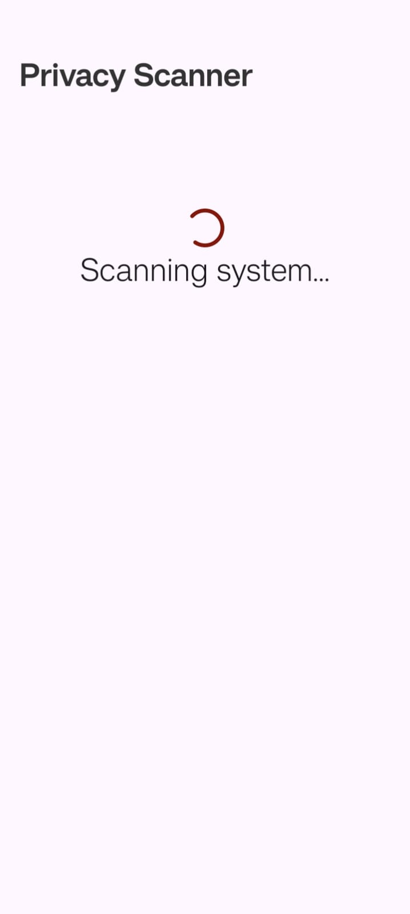
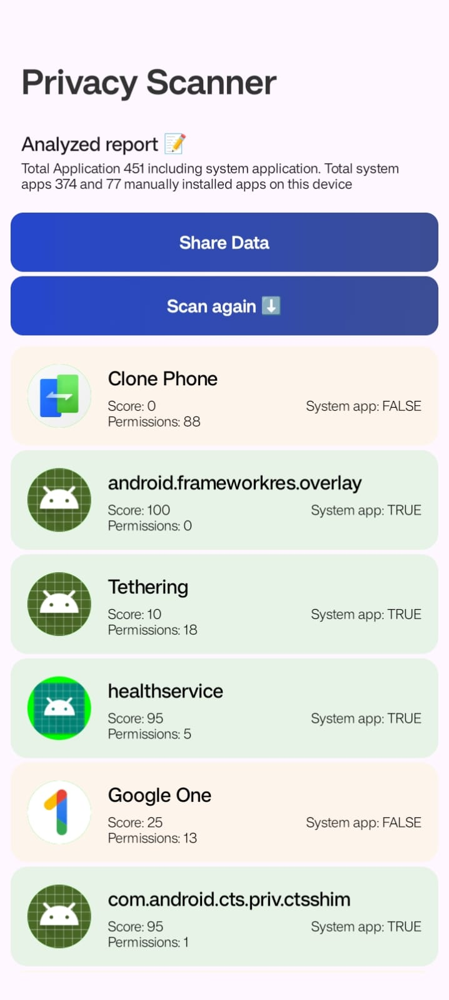

# Privacy scanner for Android

### A privacy scanner android app. That scanns through all your android system and show privacy status in a stupid simple way. 

Some screenshots attached here for ref.

### Fig: 1.1 Splash Screen with customized icon

### Fig: 1.2 Scan Screen

### Fig: 1.3 Home screen after finish scanning

## Features of the application

- User Installs the application
- User taps on the app icon. 
- The app starts immidiately showing a scan screen
- This scanning process doesn't block the UI process. You can see the spinning animation without breaking.
- After scanning the whole system, the application shows all the applications in a LazyList view. 
- User can tap on any application to see it's details. 
- User can minimize the application and the state will still be hold by the lifecycle aware view model. 
- All the heavy computational tasks are carried out by the Kotlin Coroutine where necessary. 

- Taping on scan again button will allow user to scan the whole system again. 
- The share button let's user share a small summary as text with any app that supports text sharing. 

## Steps to set up in Android Studio

1. Download the project from github by clicking the Green Code button and then Download Zip button. 

2. Extract the folder in a suitable location.(Remember the extracted folder location should not be so deep in the file system. It might cause error in the Android Studio)

3. Install android studio from official website and install the latest stable version. 

4. Opening up Android Studio for the first time will ask to download necessary SDK and other tools. Follow the instructions. 

5. Open up the extracted project folder that was downloaded and unzipped earlier. 

6. Android Studio will figure out the project, download necessary tools and SDK and build the application. 

7. Connect your android device via USB and you can directly run the app on your mobile device. 

